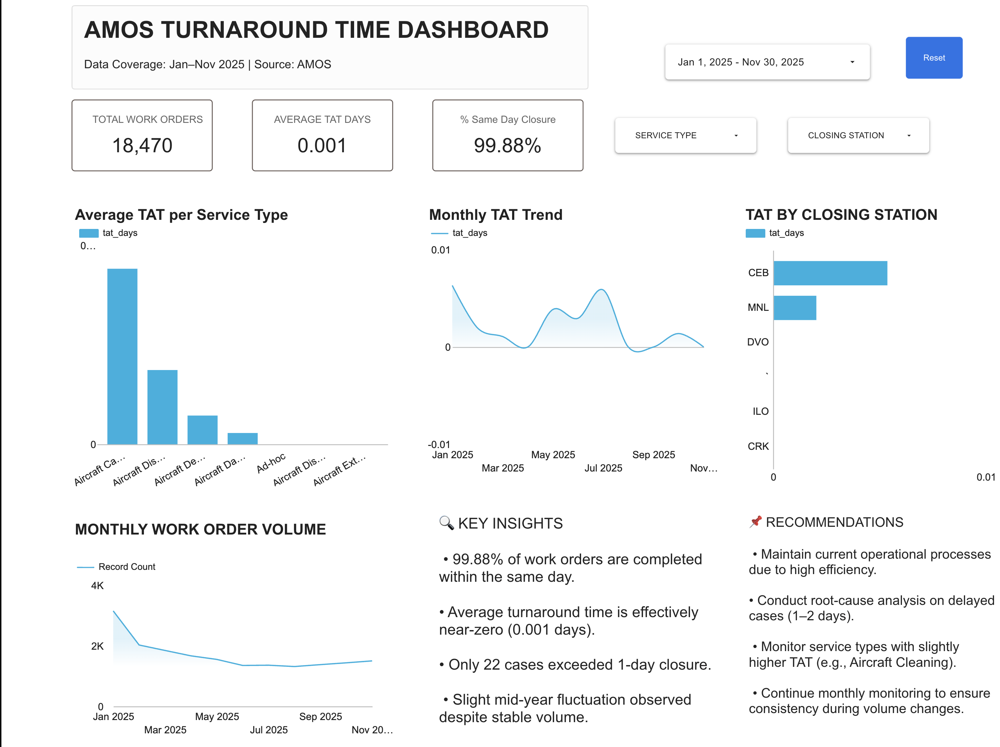

# AMOS Turnaround Time Analysis
## Project Summary

## This project analyzes AMOS maintenance work order data to evaluate operational turnaround time (TAT) performance from January to November 2025.

## The objective is to measure efficiency, identify delays, and provide operational insights using SQL and Looker Studio.

## Tools & Technologies

## PostgreSQL

## SQL

## Looker Studio

## Excel (data preprocessing)

## Data Processing Workflow

## Imported raw AMOS Excel data into PostgreSQL

## Cleaned dataset and filtered DOTAMECH records

## Standardized service types using SQL CASE logic

## Calculated Turnaround Time:

## closing_date - issue_date

## Created KPI queries for:

## Total Work Orders

## Average TAT

## Same-Day Closure %

## Built interactive dashboard in Looker Studio

## Key Insights

## 99.88% of work orders were completed within the same calendar day

## Only 22 work orders exceeded 1-day turnaround

## Operational performance remained stable across monthly volume changes

## Certain service types show slightly higher TAT and require monitoring

## Dashboard Preview

## Data Limitation

## Turnaround Time was calculated using calendar date difference due to absence of timestamp-level data.

## Future Improvements

## Include timestamp-level TAT calculation

## Perform outlier analysis

## SLA benchmarking

## Delay root cause segmentation

